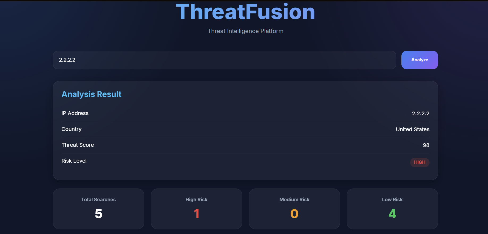
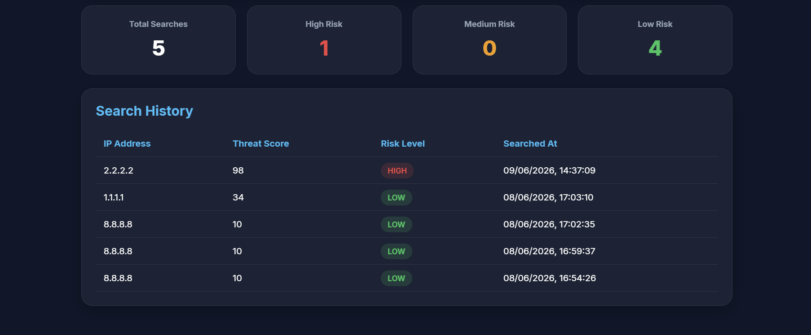

# 🛡 ThreatFusion

Hello! My name is Adam and I've developed this new application called ThreatFusion.

ThreatFusion is a full-stack threat intelligence platform built using Java, Spring Boot, React, TypeScript, and PostgreSQL.

The application enables users to perform IP address lookups, enrich results with geolocation data, track historical searches, and view threat intelligence metrics through a modern dashboard interface.

---

## Features

* IP Address Intelligence Lookup
* GeoIP Enrichment
* Threat Scoring
* Search History Dashboard
* Statistics Dashboard
* PostgreSQL Persistence
* RESTful API Architecture
* React Frontend
* Spring Boot Backend
* JUnit & Mockito Testing

---

## Technology Stack

### Backend

* Java 21
* Spring Boot
* Spring Data JPA
* Hibernate
* Maven
* PostgreSQL

### Frontend

* React
* TypeScript
* Vite

### Testing

* JUnit
* Mockito

### Tools

* Git
* GitHub

---

## Architecture

React Frontend

↓

Spring Boot REST API

↓

PostgreSQL Database

↓

GeoIP External Service

---

## Screenshots

### Dashboard




---

## Running Locally

### Backend

Create a PostgreSQL database:

```sql
CREATE DATABASE threatfusion;
```

Configure:

```yaml
application.yml
```

with your PostgreSQL credentials.

Run:

```bash
mvn spring-boot:run
```

### Frontend

Navigate to:

```bash
cd frontend
```

Install dependencies:

```bash
npm install
```

Start the application:

```bash
npm run dev
```

---

## Learning Outcomes

This project was developed to strengthen practical experience with:

* Full-stack Java development
* Spring Boot REST APIs
* PostgreSQL integration
* React frontend development
* JPA/Hibernate persistence
* Automated testing with JUnit and Mockito
* External API integrations
* Git and GitHub workflows
